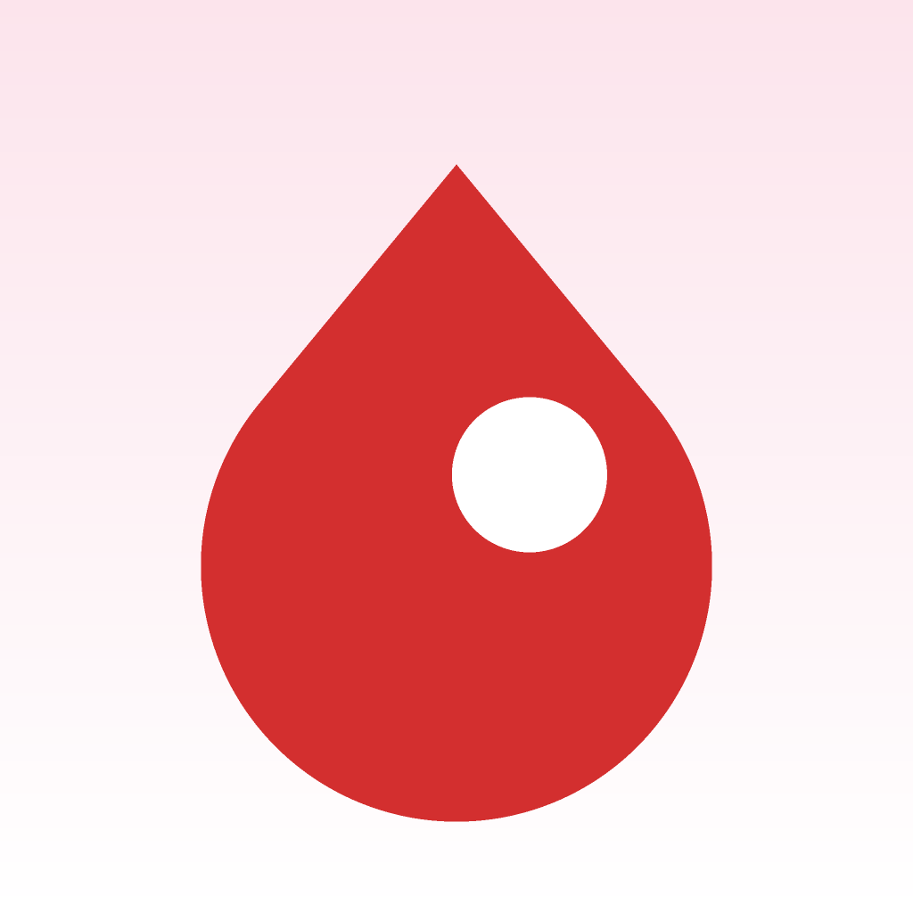

<div align="center">
  
  <h1>🩸 Anemia Care</h1>
  <p><b>Skrining anemia non-invasif dari foto kuku</b> — foto → indikasi awal → rekomendasi tindak lanjut.</p>
</div>

---

**Anemia Care** adalah aplikasi skrining anemia non-invasif berbasis **foto kuku (nail bed pallor)**:
pengguna memotret kuku via kamera HP, sistem memvalidasi kualitas citra, menganalisis warna
kuku dengan model ML, lalu memberi **indikasi awal** — 🟢 Normal / 🟡 Indikasi Ringan /
🔴 Indikasi Berat — disertai confidence score dan rekomendasi tindak lanjut (fuzzy logic).

> ⚠️ Produk ini adalah **alat skrining awal (indikasi), BUKAN pengganti diagnosis medis**.
> Hasil yang mengarah ke anemia direkomendasikan untuk pemeriksaan darah (Hb) di fasilitas
> kesehatan. Prioritas sistem adalah **sensitivitas** (jangan sampai anemia terlewat).

## 📌 Cakupan Project

Aplikasi ini menggabungkan dua project:

| Source | Isi | Status |
|---|---|---|
| **Capstone S5** — skrining anemia (ML + PCD + Fuzzy + NestJS + Web admin + DW) | `capstone/` (dataset & ML mirror) + `backend/` (NestJS) | 🚧 Bagian inti sedang dibangun |
| **Mobile Programming** (16 modul, kurikulum [arifhidayah.vercel.app](https://arifhidayah.vercel.app/flutter)) | Fondasi app + fitur latihan Modul 1–15 | ✅ Selesai (release APK) |

**Status aplikasi:**
- ✅ **Tahap 1 (Modul 1–15):** app pemantauan + fitur latihan (jadwal, galeri lab, direktori *placeholder*) — APK rilis tersedia
- 🚧 **Tahap 2 (Capstone):** fitur inti skrining foto kuku + integrasi backend NestJS — sedang dibangun

## ✨ Fitur

### 🚀 Fitur Inti Capstone (sedang dibangun)

| Fitur | Keterangan | Matkul Capstone |
|---|---|---|
| 📷 **Skrining Foto Kuku** | Capture → **gerbang validasi citra** (kuku bersih tanpa inai/kutek, struktur utuh, zona sampel cukup) → analisis ML | PCD + ML |
| 🎯 **Hasil Indikasi** | Badge 🟢/🟡/🔴 + confidence score + **disclaimer permanen** ("bukan diagnosis medis") | ML + Framework |
| 🧠 **Rekomendasi Personal (Fuzzy)** | Konteks pengguna (gejala, menstruasi, kehamilan, tipe kulit) digabung hasil visual → rekomendasi tindak lanjut | PSC1 |
| 🗂️ **Riwayat & Verifikasi** | Riwayat skrining per akun + status verifikasi petugas (web) + tren indikasi | Framework + DW |
| 🔐 **Akun** | Daftar/login — hasil & riwayat tersimpan per akun | Framework |

### 📱 Fitur Mobile Programming (Modul 1–15, selesai)

| Fitur | Keterangan | Modul |
|---|---|---|
| 📊 **Dashboard** | Ringkasan jumlah pasien, status anemia (Normal/Anemia), menu cepat responsif | 6–7 |
| 🧭 **Navigasi** | 4 tab (Beranda/Jadwal/Info/Direktori) + drawer + named routes + tab terakhir tersimpan | 8, 11 |
| 📈 **Statistik** | Visualisasi persentase pemantauan selesai (Provider/ChangeNotifier) | 9 |
| 📅 **Jadwal Pemantauan** | Tambah/tandai selesai/hapus, persisten di SQLite | 9, 11 |
| 📇 **Direktori Pasien** | REST API — **sementara JSONPlaceholder (latihan Modul 10); akan dialihkan ke backend NestJS capstone** | 10 |
| 🩸 **Logika Anemia** | Klasifikasi keparahan (edukasi manual dari nilai Hb) — ambang diselaraskan WHO 2024 | 13 |
| 🖼️ **Galeri Hasil Lab** | Foto hasil lab dari kamera/galeri, overlay tanggal, hapus (long-press) | 12 |
| 🧪 **Testing** | 35 unit/widget test + integration test + cakupan 86.6% baris `lib/` | 13 |

## 🎯 Konsep & Batasan (dari Capstone)

- **Indikasi awal, bukan diagnosis** — output diframing sebagai skrining + rekomendasi cek darah, bukan penetapan diagnosis.
- **Sensitivitas diutamakan** — recall tinggi untuk kelas anemia, spesifisitas menyusul (tidak ada anemia terlewat).
- **Ambang WHO 2024** — anemia: Hb < 12,0 g/dL (wanita dewasa non-hamil) / < 13,0 g/dL (pria dewasa); disesuaikan usia & kehamilan. Skrining binary memakai cut-off 12,0 g/dL (lihat `capstone/scripts/preprocess/02_preprocess.py`).
- **Nail bed pallor** — tanda klinis yang sah (WHO IMCI); sinyal warna kuku **lemah untuk anemia ringan**, jadi akurasi tidak boleh dijanjikan presisi (estimasi ±10–15 g/L).
- **Tidak menjanjikan estimasi Hb presisi** — Hb ditampilkan sebagai pendukung/regresi, bukan pengganti lab.

## 📲 Install

Unduh APK rilis dari **[Releases](https://github.com/xzael24/anemia-care/releases)**:

- `app-release.apk` — universal (semua arsitektur, **50.4 MB**)
- `app-arm64-v8a-release.apk` — khusus ARM64 (kebanyakan HP modern, **17.8 MB**)

Cara install: buka file APK di HP Android → izinkan "Install dari sumber tidak dikenal" → selesai.

## 🔧 Build dari Source

```bash
flutter pub get
flutter run                # jalanin di emulator/device
flutter test --concurrency=1   # 35 test (wajib --concurrency=1 di RAM kecil)
flutter build apk --release    # → build/app/outputs/flutter-apk/app-release.apk
flutter build appbundle --release  # → app-release.aab (Play Store)
```

## 🐳 Deploy (Docker Compose)

Stack backend + ML dibungkus container (`docker-compose.yml`):

| Service | Image | Port | Fungsi |
|---|---|---|---|
| `api` | `anemia-api` | 3000 | Backend NestJS (`/api/*`) |
| `ml` | `anemia-ml` | 8000 | Sidecar ML FastAPI (RandomForest 33D) |
| `db` | `postgres:16-alpine` | 5432 (internal) | Persistensi riwayat skrining (TypeORM synchronize) |

**Jalankan lokal (Docker Desktop):**

```bash
docker compose up -d --build
curl http://localhost:3000/api/health
```

**Deploy ke VM Cloud (Ubuntu Server + Docker, host-only `192.168.56.101`):**

```bash
# 1) paket source (tanpa node_modules/dist/.venv)
tar -czf deploy/anemia-deploy.tar.gz --exclude=backend/node_modules --exclude=backend/dist --exclude=backend/.env --exclude=ml_service/.venv backend ml_service docker-compose.yml

# 2) kirim & ekstrak di VM
scp deploy/anemia-deploy.tar.gz ubuntu-srv:~/
ssh ubuntu-srv "mkdir -p ~/anemia && tar -xzf ~/anemia-deploy.tar.gz -C ~/anemia && cd ~/anemia && docker compose up -d --build"

# 3) tes dari Windows
curl http://192.168.56.101:3000/api/health
curl -F "photo=@foto_kuku.jpg" http://192.168.56.101:3000/api/screening
```

**Terverifikasi (Sep 2026):** container `api` + `ml` + `db` healthy di VM; foto anemic → `source:"ml"`, confidence 0,92 (indikasi anemia); foto non-anemic → FP anemia 0,67 (konsisten spec 0,771). **Persistensi terbukti:** riwayat tersimpan di Postgres & tetap ada setelah `docker compose restart api`. **Auth terbukti:** login → JWT HS256 (8 jam), `GET /api/screening` 401 tanpa token / 200 dengan token. **Web admin terbukti (browser E2E):** login → dashboard (statistik + tabel riwayat) → verifikasi per-skrining → status `terverifikasi` + verifikator tersimpan di Postgres.

> Catatan: tanpa `DB_HOST` (mis. unit test), riwayat & akun disimpan di memori (default aman). **Ganti `JWT_SECRET`/`ADMIN_PASSWORD` di environment produksi!** Langkah berikutnya: integrasi Flutter (`dio` → layar skrining), DW star schema.

## 🔌 API Endpoints

| Method | Endpoint | Akses | Fungsi |
|---|---|---|---|
| `POST` | `/api/screening` | Publik | Skrining: upload foto kuku (`photo`) → indikasi awal |
| `GET` | `/api/screening` | `admin`/`petugas` | Riwayat skrining (terbaru dulu, max 100) |
| `PATCH` | `/api/screening/:id/verify` | `admin`/`petugas` | Verifikasi hasil oleh petugas (human-in-the-loop) |
| `POST` | `/api/auth/login` | Publik | Login petugas → `{ accessToken, petugas }` |
| `GET` | `/api/auth/me` | Token | Info petugas yang login |
| `GET` | `/api/health` | Publik | Health check (Terminus) |

Credential default dev: `admin` / `admin123` (seed otomatis saat tabel `petugas` kosong).

## 🏗️ Teknologi

Flutter · Dart · Provider · sqflite (SQLite) · shared_preferences · http (sementara JSONPlaceholder) / **dio → backend NestJS (proyek `backend/`)** · image_picker · path_provider · flutter_launcher_icons · flutter_native_splash · **Web admin: React + Vite + TypeScript (proyek `web_admin/`)**

## 📂 Struktur

```
lib/                    # kode app Flutter
backend/                # API NestJS (capstone) — lihat backend/README.md
ml_service/             # Sidecar ML FastAPI (RandomForest 33D) — lihat ml_service/README.md
web_admin/              # Web admin monitoring petugas (React + Vite + TS) — lihat web_admin/README.md
docker-compose.yml      # Stack deploy: api (NestJS) + ml (FastAPI) + db (Postgres)
deploy/                 # Package deploy (tarball, git-ignored)
capstone/               # mirror dataset + ML + docs capstone (sumber: repo CAPSTONE)
  data/                 #   dataset (raw/processed/artifacts)
  scripts/              #   preprocessing, training, evaluasi
  docs/                 #   KONSEP.md, guideline WHO 2024, dll
lib/
  main.dart             # App Shell: 4 tab + Provider + named routes
  models/               # AnemiaLogic, JadwalModel, UserPasien...
  services/             # PasienService (API), JadwalStore (SQLite), GaleriLabService
  screens/              # Dashboard, Direktori, Galeri, Statistik, Tentang...
  widgets/              # ProfileCard
test/                   # 35 test (unit + widget)
integration_test/       # E2E happy path (butuh emulator)
lessons/                # Catatan belajar 16 modul (HTML)
learning-records/       # Refleksi tiap modul
```

## ⚠️ Disclaimer

Aplikasi memberikan **indikasi awal skrining non-invasif, bukan diagnosis medis**. Klasifikasi
mengikuti ambang WHO 2024 (binary skrining: Hb < 12,0 g/dL → indikasi anemia; penyesuaian
per gender/usia dijelaskan di `capstone/docs/KONSEP.md`). Konsultasikan dengan tenaga kesehatan
untuk pemeriksaan darah (Hb) resmi dan keputusan medis.

---

<p align="center"><b>Anemia Care</b> · Mobile Programming + Capstone S5 · dibuat dengan ❤️ menggunakan Flutter</p>